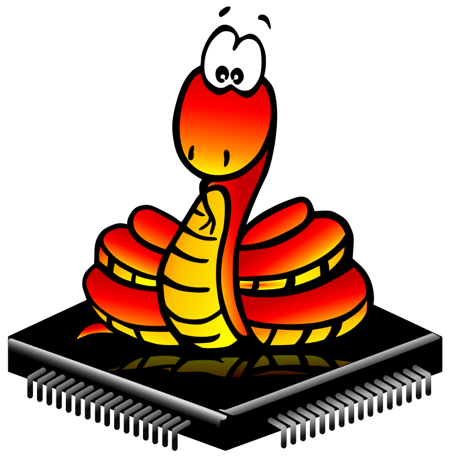
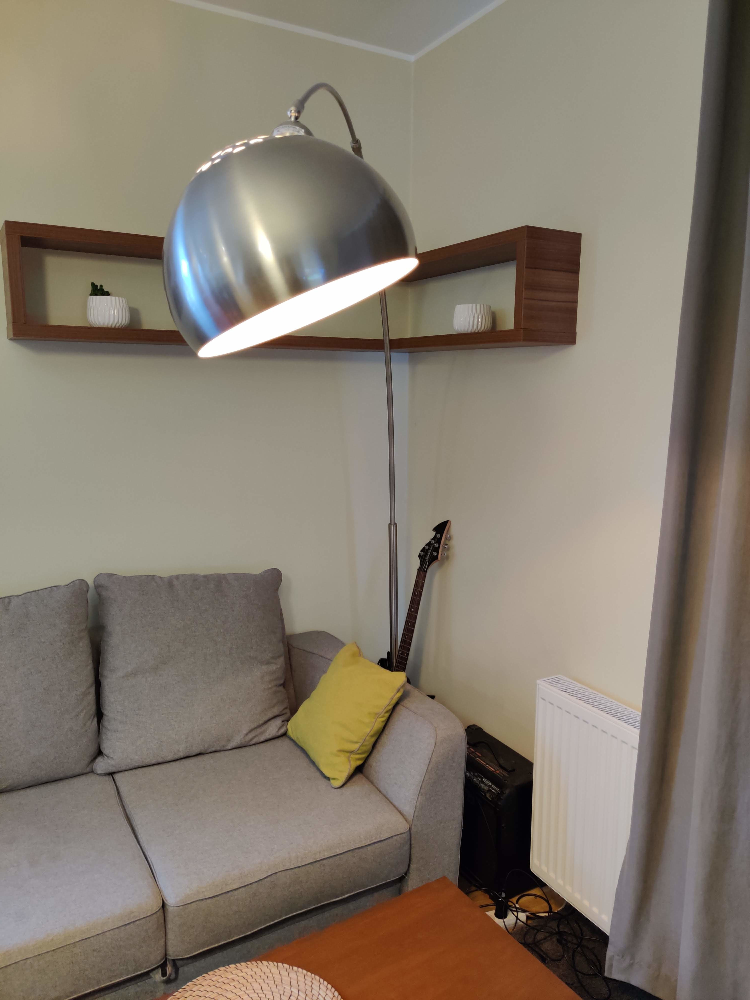
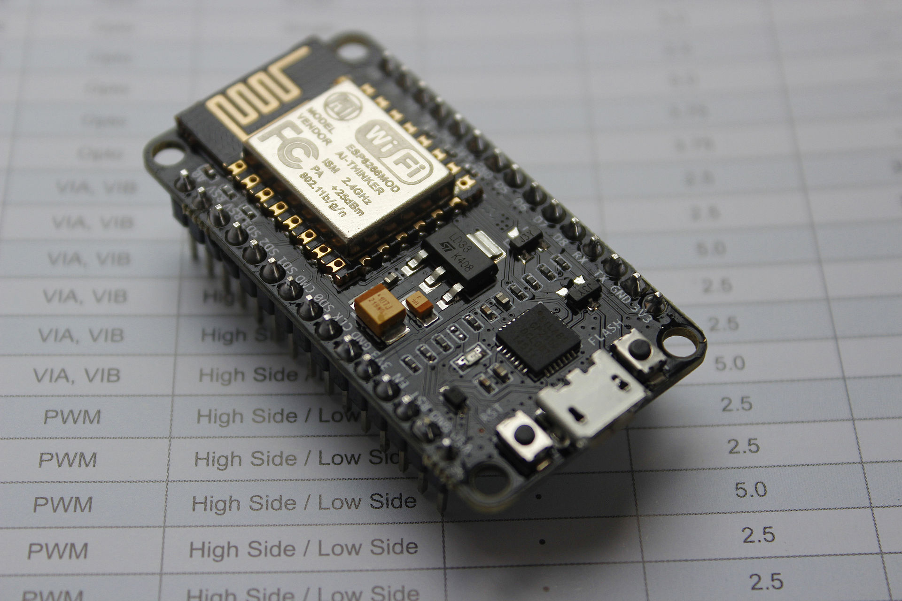
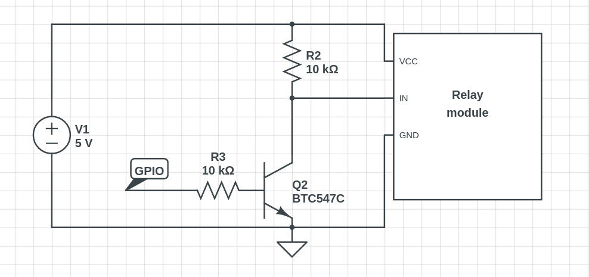

---

highlightTheme: Railscasts

---

## MicroPython & Smart Home
{ width=50% }

note: Chciałbym wam opowiedzieć o mojej przygodzie z Micropythonem i smart domem

---

## Problem statement

{ width=50% }

note: Skąd wziął się pomysł na to co chcę pokazać

---

#### Ktoś już rozwiązał ten problem...
{ width=75% }

note: Ale wzięcie gotowca było by za proste i bez funu :)

---

## Prototyp
{ width=75% }

note: Prototyp, który powstał w kilka dni. Składa się z trzech, a w zasadzie dwóch elementów.

--

### NodeMCU
{ width=75% }

note: DevKit NodeMCU z popularnym chipem ESP8266. Przede wszystkim otrzymujemy built-in WiFi, a poza tym około 10 GPIO, PWM, SPI, I2C itp. Ma wbudowany bootloader, dzięki czemu nie potrzeba extra sprzętu do przepalania FW.

--

### Przekaźnik 5V - 230V
{ width=75% }

note: Przekaźnik do sterowania ON/OFF prądem o napięciu 230V. Niestety nie znalazłem przekaźnika sterowanego 3.3V, a jedynie 5V (popularne Arduino...), dlatego musiałem dorobić prosty układ pozwalający sterować za pomocą 3V pinu.

--

{ width=75% }

note: Prosty układ oparty o tranzystor NPN. Gdy na GPIO jest stan niski - na wejściu przekaźnika jest masa, co aktywuje przekaźnik. Gdy na GPIO jest 3.3V - na wejściu 5V, wyłączając go.

--

### Micropython
{ width=50% }

note: Czym jest micropython: w skrócie oszczędna implementacja Pythona 3 (subset) zoptymalizowana pod kątem uruchamiania na mikrokontrolerach (ale nie tylko - jest port linuksowy).
Dlaczego zdecydowałem się na uPython? Bo lubię Pythona, jest szybki w prototypowaniu. W zasadzie byłem w stanie napisać i przetestować (chociaż nie dokońca) cały soft na PC a potem uruchomić na devkicie.
Można by się spierać i znaleźć inne lepsze, ale nie o tym jest ta przezntacja :)

--

# Demo

--

### [BLYNK.IO](https://blynk.io)

 We make Internet of Things **simple**{.fragment .highlight-green}

{ width=50% }

--

### Kod obsługi przekaźnika
```python
relay_pin = machine.Pin(12, machine.Pin.OUT)

@blynk.handle_event("write V12")
def set_relay(pin, values):
    relay_pin.value(int(values[0]))

@blynk.handle_event("read V12")
def read_relay():
    blynk.virtual_write(12, relay_pin.value)
```

--

### Kod obsługi diod NeoPixel
```python
from neopixel import NeoPixel
neopin = machine.Pin(13, machine.Pin.OUT)
neopixel = NeoPixel(neopin,1 )

@blynk.handle_event("write V13")
def handler_neopixel(pin, values):
    assert len(values) == 3
    values = [int(val) for val in values]
    
    neopixel[0] = [values[1], values[0], values[2]]
    neopixel.write()
```

---

# SONOFF
{ width=50% }
