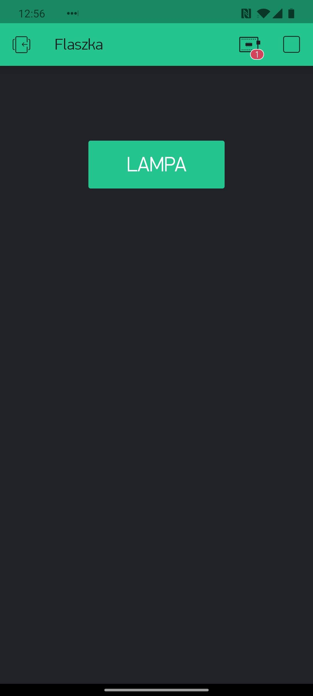
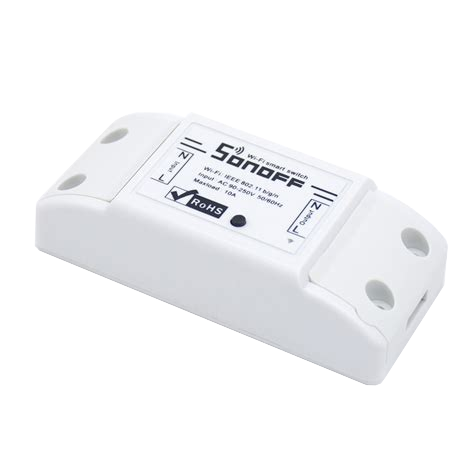

## SmartHome economy ft. MicroPython on ESP8266
{ width=45% style="background:none; border:none; box-shadow:none;" }

note: Chciałbym wam opowiedzieć o mojej przygodzie z Micropythonem i smart domem
Pokazać, że można to zrobić tanio i przy okazji samemu, co daje satysfakcję.

---

## Problem statement

{ width=40% style="background:none; border:none; box-shadow:none;" }

note: Skąd wziął się pomysł na to co chcę pokazać <br>
To jest lampa u mnie w salonie, włącznik na kablu gdzieś TAM za piecem<br>
Fajnie by było móc włączyć swiatło bez schylania się, np telefonem

---

#### Ktoś już rozwiązał ten problem...
{ width=75% style="background:none; border:none; box-shadow:none;" }


|||
---: | :---
{ align=center width=50% style="background:none; border:none; box-shadow:none;" } | budżet 50zł

{ align=center width=50% style="background:none; border:none; box-shadow:none;" }  | no fun

note: Ofc jak to zazwyczaj bywa okazuje się, że ktoś już to zrobił<br>
Ale są dwa "ale"<br>
1 - prawdopodobnie chciałbym to zastosować w wielu miejscach, więc warto ograniczyć koszta -
2 - we wzięciu gotowca nie ma funu ani satysfakcji

---

## Prototyp
{ width=75% style="background:none; border:none; box-shadow:none;" }

note: Prototyp, który widzicie na zdjęciach powstał w kilka dni. Składa się z trzech, a w zasadzie dwóch elementów.

--

### NodeMCU
{ width=75% style="background:none; border:none; box-shadow:none;" }

note: DevKit NodeMCU z popularnym chipem ESP8266. Przede wszystkim otrzymujemy built-in WiFi, a poza tym około 10 GPIO, PWM, SPI, I2C itp. Ma wbudowany bootloader, dzięki czemu nie potrzeba extra sprzętu do przepalania FW.

--

### Przekaźnik 5V - 230V
{ width=75% }

note: Przekaźnik do sterowania ON/OFF prądem o napięciu 230V. Niestety nie znalazłem przekaźnika sterowanego 3.3V, a jedynie 5V (popularne Arduino...), dlatego musiałem dorobić prosty układ pozwalający sterować za pomocą 3V pinu.

--

{ width=75% }

note: Prosty układ oparty o tranzystor NPN. Gdy na GPIO HIGH - na IN przekaźnika jest masa, co aktywuje przekaźnik. Gdy na GPIO LOW - na IN 5V, wyłączając go.
nie jest rocket-since, ale przez to dodatkowa plytka, wiecej kabli

--

### koszt

|||
--- | ---:
NodeMCU devkit | 20 zł
przekaźnik | 4 zł
tranzystor | 1 zł
**RAZEM** | **25 zł**

---

# Micropython
{ width=30% style="background:none; border:none; box-shadow:none;" }
- 256kB ROM
- 16kB RAM

note: Czym jest micropython: w skrócie oszczędna implementacja Pythona 3 (subset) zoptymalizowana pod kątem uruchamiania na mikrokontrolerach (ale nie tylko - jest port linuksowy).<br>
Dlaczego zdecydowałem się na uPython? Bo lubię Pythona, jest szybki w prototypowaniu. W zasadzie byłem w stanie napisać i przetestować (chociaż nie dokońca) cały soft na PC a potem uruchomić na devkicie.

--

### Features:

- REPL --> możliwość eksperymentowania
- WebREPL - REPL po websocket - bez kabla
- "baterie w zestawie" :)
  - HW (GPIO, PWM, I2C, SPI, etc.)
  - network sockets
  - JSON parsing
  - i wiele innych...
- C/C++ extensions

note: czego nie ma w corze: wielu modułów z standard liba, ale jest upip

--

# Demo

note: Każdy język ma swój hellowworld. W embedded - mruganie dioda<br>
LED pin 14<br>
w = network.WLAN(network.STA_IF)<br>
w.ifconfig()<br>
pokazać upip install("functools")

---

# [BLYNK.IO](https://blynk.io)

We make Internet of Things **simple**

{ width=50% style="background:none; border:none; box-shadow:none;" }

note: platforma dla IOT, obsługa przez aplikacje<br>
ciekawy model biznesowy: widgety za pkty, pkty za kase (startowe darmowe pkty wystarczaja)<br>
gotowy projekt możemy sharowac (2 metody: link oraz eksport do niezaleznej aplikacji)

--

{ width=40% style="background:none; border:none; box-shadow:none;" }

--

{ width=40% style="background:none; border:none; box-shadow:none;" }

--

{ width=40% style="background:none; border:none; box-shadow:none;" }

note: Dajemy mu nazwę, na maila otrzymujemy token który posłuży do połączenia z serwerem.

--

{ width=100% style="background:none; border:none; box-shadow:none;" }

--

{ width=40% style="background:none; border:none; box-shadow:none;" }

note: 256 wirtualnych<br>
push - 1stanowy, switch - 2stanowy

--

{ width=40% style="background:none; border:none; box-shadow:none;" }

--

### Kod obsługi przekaźnika

```python
relay_pin = machine.Pin(3, machine.Pin.OUT)
blynk = blynklib.Blynk(BLYNK_AUTH)

@blynk.handle_event("write V3")
def write_relay(pin, values):
    relay_pin.value(int(values[0]))

@blynk.handle_event("read V3")
def read_relay():
    blynk.virtual_write(3, relay_pin.value)
```

<!-- --

### Kod obsługi diod NeoPixel

```python
from neopixel import NeoPixel
neopin = machine.Pin(13, machine.Pin.OUT)
neopixel = NeoPixel(neopin,1 )

@blynk.handle_event("write V13")
def handler_neopixel(pin, values):
    values = [int(val) for val in values]
    neopixel[0] = [values[1], values[0], values[2]]
    neopixel.write()
```

note: neopixel - max dlugosc? -->

---

## Prototyp

{ width=75% style="background:none; border:none; box-shadow:none;" }

note: Wróćmy do prototypu.<br>
230V / 5V. Niekoniecznie chciałbym trzymać coś takiego za kanapą 24h/dobę. Porażenie domowników / spalenie chałupy.<br>
Dlatego postanowiłem poszukać sposobu na zamknięcie tego w obudowie...

---

## SONOFF

{ width=70% style="background:none; border:none; box-shadow:none;" }

note: znowu okazało się, że ktoś był pierwszy.<br>
W środku ten sam chip, przekaźnik, stabilizator U 230->3V<br>
Z 1 strony zasilanie, z 2 - urzadzenie<br>
Aplikacja eWeLink - button do wlaczania<br>
Jednak nie tak super - app rząda praw do wszystkiego (nawet lokalizacja), chińskie servery<br>
Ale są wyciągnięte linie potrzebne do programowania, jest bootloader. Trzeba tylko dolutować piny

--

## Koszt

|||
--- | ---:
1-razowo USB - UART | 10 zł
sonoff basic | 26 zł

---

# Dzięki za uwagę
https://github.com/poszu/blynk-sonoff

note: To co wam pokazałem to tylko początek możliwości tego co można zrobić łącząc ESP8266 i Blynk.io.<br>
Mikrokontroler wspiera interfejsy tj. I2C/SPI/UART dzięki czemu pozwala na połączenie różnych czujników lub urządzeń wykonawczych a Blynk pozwala w łatwy sposób nimi zarządzać.<br>
SONOFF ma w ofercie wiele urządzeń, większość z ESP
